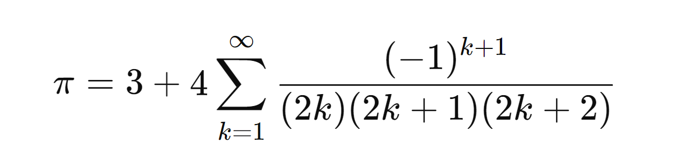
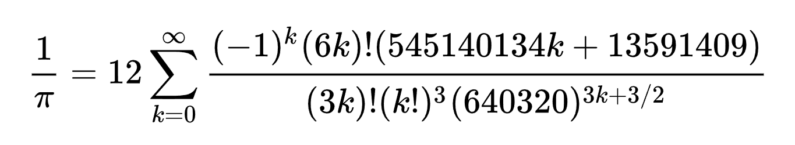
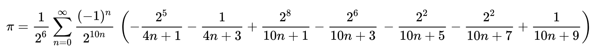
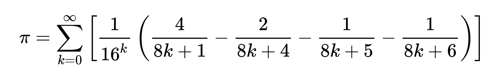

## Table of Contents
1. [Introduction](#intro)
2. [Algorithms Tried](#algorithms)
    - [Leibniz Series](#1leibniz-series)
    - [Nilakantha Series](#2-nilakantha-series)
    - [Chudnovsky Algorithm](#3-chudnovsky-algorithm)
    - [Bellard's Formula](#4-bellards-formula)
    - [Bailey-Borwein-Plouffe (BBP) Formula](#5bailey-borwein-plouffe-bbp-formula)
    
3. [Final Algorithm Chosen](#final-algorithm-chosen)
4. [Implementation in Java](#implementation-in-java)
5. [Challenges and Solutions](#challenges-and-solutions)
6. [Semaphore](#semaphore)

[All References and Resources](#all-references-and-resources)
# Pi Calculator
## Intro
To calculate the value of π using multithreading in Java for improved accuracy and performance, I researched and
experimented with around five different algorithms. Each of these algorithms came with its own set of advantages 
and challenges.
## 3.14...
The number π is a mathematical constant that is the ratio of a circle's circumference to its diameter, approximately equal
to 3.14159. The number π appears in many formulae across mathematics and physics. It is an irrational number, meaning that 
it cannot be expressed exactly as a ratio of two integers, although fractions such as 22/7 are commonly used to approximate
it. 

## Algorithms

### 1.Leibniz Series
This series discovered by James Gregory and Gottfried Wilhelm Leibniz,
it's easy to understand and implement, but it converges really slowly,
so you need a lot of terms for decent accuracy.

### 2. Nilakantha Series
This series derived by Indian mathematician Nilakantha Somayaji and converges faster than the Leibniz series but still
requires many terms for high accuracy.

### 3. Chudnovsky Algorithm
This algorithm is extremely efficient for high precision calculations of π. It converges very quickly and is used in
many of the world record calculations of π.

### 4. Bellard's formula
Bellard's formula is a modification of the BBP formula and is about 43% faster. It is efficient for computing π to a
large number of digits and is used in high precision calculations.

### 5.Bailey-Borwein-Plouffe (BBP) Formula
It was discovered in 1995 by Simon Plouffe and this formula gives rise to a spigot algorithm for computing the nth 
base-16 (hexadecimal) digit of π (and therefore also the 4nth binary digit of π) without computing the preceding digits.

## Final Algorithm Chosen

After considering the various algorithms, I chose the **Bailey-Borwein-Plouffe (BBP) Formula** for calculating π using multithreading. The BBP formula offers a good balance between complexity and efficiency, and its ability to calculate digits of π directly makes it well-suited for parallel processing.

**Advantages of BBP Algorithm**:
- **Direct Calculation**: Can compute specific digits of π without needing all preceding digits.
- **Parallelizable**: The formula allows for splitting the computation into independent tasks, making it ideal for multithreading.
- **Efficiency**: Faster convergence compared to simple series like Leibniz and Nilakantha, especially when implemented 
with high precision arithmetic.

## Implementation in Java

The Java code demonstrates the implementation of the BBP algorithm using multithreading to calculate the 
value of π in the `PiCalculator` class.
This code uses the BBP formula to calculate π and leverages multithreading to improve performance. The results are 
synchronized to ensure thread safety, and the final value of π is returned to the specified precision.

## Challenges and Solutions
One of the main challenges I faced was passing the final test case, which required a higher level of precision.
To address this, I **increased** the `MathContext (mc)` to ensure sufficient precision during the calculations.
>_This adjustment allowed the algorithm to converge more accurately and pass the test case successfully._

Additionally, to prevent redundant calculations or additions of partial sums, I introduced a boolean flag (calculated)
to track whether the calculation has already been performed or added.
> _This flag ensures that the calculation is only 
performed once, even in a multithreaded environment, avoiding unnecessary computations and ensuring accuracy._

# Semaphore
A Semaphore is used to manage a resource that is going to be accessed by multiple users. It can manage the access by
letting a few numbers of threads to run, and holding others till one the running threads finishes processing.
This is not the same as locking a resource, as there could only be one user/thread that could access that resource
at a given time. A semaphore can let multiple threads to access the resource at once.

### Use Cases
- **Resource Allocation:**
  Semaphores can be used to allocate a limited number of resources to multiple threads. For example, a database 
 system may have a limited number of connections it can handle at a time.
 A semaphore can be used to keep track of the number of available connections and control access to them, 
 ensuring that the number of connections does not exceed the maximum allowed.
- **Mutual Exclusion:** 
Semaphores can also be used to enforce mutual exclusion, which is the idea that only one thread at a time can access a
critical section of code. This is useful for preventing race conditions, where two or more threads try to access and
modify the same data at the same time.
- **Database Access:** To ensure that the queries and operations that are done on a database won’t lead to corruption of 
data, a semaphore can be used to manage the number of clients and operations that are done on a database.

## All References and Resources
- [Pi - _Wikipedia_ ](https://en.wikipedia.org/wiki/Pi)
- [Bellard's formula  - _Wikipedia_](https://en.wikipedia.org/wiki/Bellard%27s_formula#:~:text=Bellard's%20formula%20is%20used%20to,now%2Dcompleted%20distributed%20computing%20project.)
- [Chudnovsky algorithm - _Wikipedia_ ](https://en.wikipedia.org/wiki/Chudnovsky_algorithm)
- [Semaphore - _Geeks for Geeks_ ](https://www.geeksforgeeks.org/semaphore-in-java/)
- [Semaphore use cases - _Medium_](https://blog.devgenius.io/understanding-semaphores-a-guide-to-the-3-major-use-cases-590cbef292a4)
